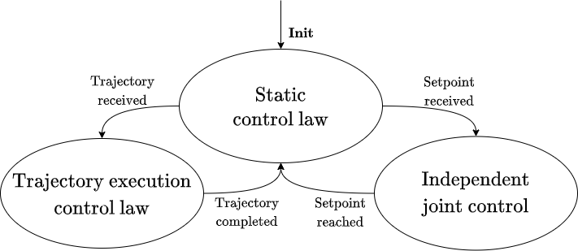
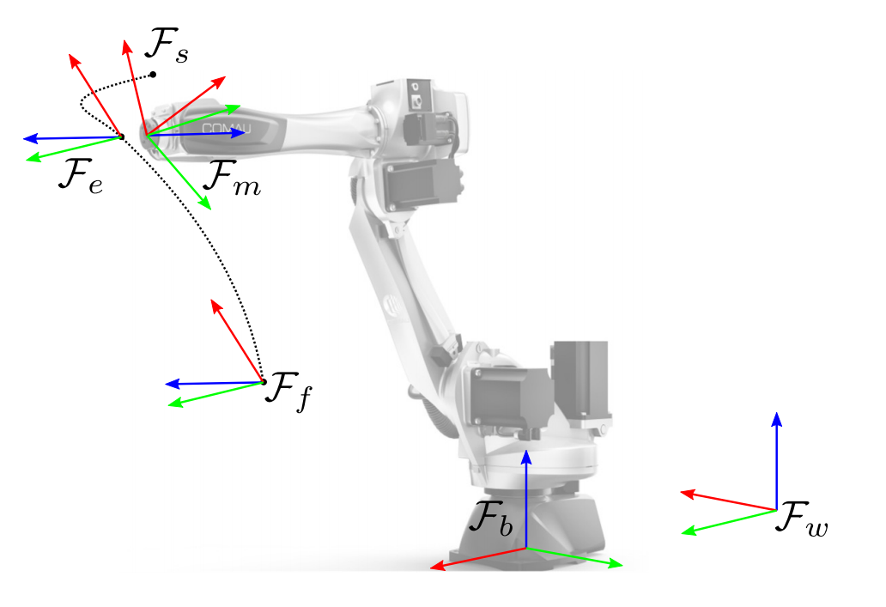

# ros_control_controllers

This is a container for robot-agnostic `ros_control` controllers.

For further information about `ros_control` and related controllers, please refer to [this page](http://wiki.ros.org/ros_control). Before using `ros_control` and to develop your own controller, please carefully read this documentation and take time to watch the linked videos.

## Some introductory information to interaction controllers

In order to use interaction controllers correctly, it is important to know some implementation details.
The algorithms were designed as a state machine. A finite state machine, or FSM, is a computational model based on a hypothetical machine made up of one or more states. Only a single state can be active at the time, so the machine has to switch between states to perform several actions. An FSM can be represented by a graph, in which the nodes are the states and the links are the transitions. Each link has a label to know when the transition should take place.



The choice to implement the algorithm as a state machine is due to the different requirements that need to be satisfied. As shown in figure, the designed architecture considers two incoming events: a desired single point or a desired trajectory. When using the communication
mechanisms of the framework based on ROS actions, the algorithm must be able to receive an event, and more specifically be able to understand whether this is a single point to be reached, or a trajectory to be executed. This difference was introduced for several reasons:

* to execute a trajectory it is necessary to reach the starting point with absolute precision. If it was reached through the control law, it would not be certain that the actual point is the one desired, since the two interaction control laws generate a position error based on the input force error;
* the specific control law works with a fixed orientation. The independent joint control must be used to command an orientation for the end-effector since it is the only control in which the end-effector is positioned in the desired position with absolute precision. For this reason, once the target point has been reached, the bias of the force/torque sensor is recomputed, depending on the orientation of the end-effector.

The FSM consists of 3 states and 5 events. The states are:

* _Static Control Law_: the algorithm simply executes the control law, with null force and constant position references; the control law is not computed on orientation, i.e. torques exerted on the end-effector are not used to modify the orientation.
* _Trajectory Execution Control Law_: the algorithm still executes the control law but receives a desired trajectory as input.
* _Independent Joint Control_: the specific control law is not executed, independent joint control is performed in order to reach the desired position with absolute precision.

The transitions are:

* _Init_: occurs when the controller is made active by the controller manager;
* _Trajectory received_: occurs when a trajectory is received;
* _Setpoint received_: occurs when a setpoint is received;
* _Trajectory completed_: occurs when the execution of the trajectory is completed;
* _Setpoint reached_: occurs when the setpoint is reached;

## Reference frames

The reference frames used by the interaction controllers are reported in the figure below.



F_b is the *base* reference frame, usually used to specify the workspace trajectory. F_w is the *world* reference frame, and, when different from F_b, might be used to interpret the pose subject to inverse kinematics. F_b is transformed into F_w through the constant transformation matrix T_b_w. F_m is the flange frame (usually the last frame in a kinematic chain without end-effector), and is where the force/torque sensor is mounted. F_s is the sensor frame, with respect to which force/torque measures are given. The constant transformation matrix T_m_s depends on the mechanical interface between the flange and the sensor. F_f is the end-effector frame when the robot is at the trajectory's starting point, while F_e is the end-effector-fixed moving frame.

## Change robot spawn position in Gazebo

If you want to change the robot spawn position in Gazebo, you have to start Gazebo with the physics paused.

In the launch file you use to start Gazebo, pass the `paused` argument to the `world.launch` included file.

```bash
  <include file="$(find gazebo_ros)/launch/empty_world.launch">
    <arg name="paused" value="true"/>
  </include>
```

Then:

* set the robot joint positions by passing the value of each joint to the `spawn_model` node with the parameter `-J joint_name joint_position`
* unpause Gazebo by passing the param `-unpause` to the `spawn_model` node

```bash
  <node name="spawn_gazebo_model" pkg="gazebo_ros" type="spawn_model" args="-urdf -param robot_description -model robot -z 0.1
    -J shoulder_pan_joint 1.251052
    -J shoulder_lift_joint -1.733112
    -J elbow_joint 2.3366468
    -J wrist_1_joint -2.03959176
    -J wrist_2_joint -1.6447983
    -J wrist_3_joint -1.77779238
    -unpause"
  respawn="false" output="screen"/>
```

## Change control loop frequency in Gazebo

If you want to change the control loop frequency in Gazebo, whose default value is 1000, you have to pass to the Gazebo plugin the desired value inside the `<controlPeriod>` tag.

For example, if you want to set the control loop frequency to 125 Hz, this is the XML plugin that should be added to your URDF:

```bash
<gazebo>
  <plugin name="gazebo_ros_control" filename="libgazebo_ros_control.so">
    <controlPeriod>0.008</controlPeriod>
  </plugin>
</gazebo>
```

For the time being, a control period greater than the simulation period (0.001 s) causes unexpected robot behavior in Gazebo. It is possible to solve this problem by making some modifications to `gazebo_ros_control_plugin.cpp`. Look at [this thread](https://github.com/ros-simulation/gazebo_ros_pkgs/issues/125) for additional info.
