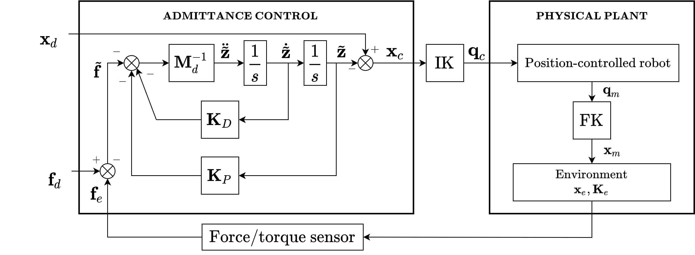

# Admittance Controller

## Introduction and Control Schema

This package implements a position-based impedance control.

The figure below shows the impedance control schema, considering only the positional task during the interaction, while orientation is fixed.



The controller uses a `PositionHardwareInterface` and works with any orientation in the operational space, as long as it is fixed during the task execution.

The `admittance_controller` expects several parameters to be loaded onto the parameter server. Parameters can be loaded by configuring the launch file(s) for each specific robot. See, in particular, [`admittance_controller_ur10_sim.yaml`](../../ur10_acg_configuration/config/admittance_controller_ur10_sim.yaml) and [`ur10_interaction_control_sim_parameters.yaml`](../../ur10_acg_configuration/config/ur10_interaction_control_sim_parameters.yaml) as an example.

Control parameters are:

- `ik_timeout`: the timeout for finding the kinematic inversion expressed in seconds;
- `ik_tolerance`: maximum joints variation allowed in radians (for each control loop);
- `loop_frequency`: update frequency of the controller in Hertz;
- `mass_matrix`, `damping_matrix`, `stiffness matrix`: diagonal matrices that define the dynamic behavior along the directions in the workspace (note that `mass_matrix` is the inverse of the matrix M_d in the diagram above);
- `sp_tolerance`: maximum error for each joint in reaching the set point in radians.

Robot parameters expected by the controller are:

- `joint_model_group`: the planning group to use;
- `base_frame_name`: the reference frame F_b with respect to which the references are given;
- `force_torque_sensor_mounting_name`: the reference frame F_m corresponding to the force/torque sensor mounting point;
- `force_torque_sensor_frame_orientation`: the orientation of the force/torque sensor frame F_s with respect to its mounting frame F_m, expressed in radians with RPY angles in fixed frame, meaning that the angles are provided in the order Z (yaw), Y (pitch), X (roll).

Note that the base frame F_b and the force/torque sensor frame F_s are not necessarily present within the kinematic chain. In particular, do not confuse the reference frame of the force/torque sensor F_m with the reference frame of the end-effector F_e. The latter is automatically extrapolated from the planning group you want to use.
Taking as an example the configuration for the UR10, the reference frame chosen for planning is the `base` frame (coinciding with the base frame of the real robot), which is different from the `world` frame used by default. Moreover, the end-effector frame of the planning group `manipulator` is the `tool0` frame, which, in the case of simulated robot, does not coincide with the frame used for the Gazebo force/torque sensor `wrist_3_link`. Pay attention to the configuration.
Furthermore, the `force_torque_sensor_frame_orientation` parameter is used to specify the orientation of the force/torque sensor if it is different from that of the mounting frame. For instance, the force/torque sensor mounted on the UR10 in the Robotics Lab @UNISA is rotated of 45 degrees around the z-axis with respect to the `tool0` frame.

This controller is implemented with an action interface, so it can receive workspace trajectories from a workspace trajectory action client, as the one provided in the `follow_workspace_trajectory_action_client` package, by using the topic `/admittance_controller`. Force/torque references should be part of this trajectory and should be given in end-effector frame. Rather, as usual, positions and orientations of the end-effector are given in the base frame, i.e. the one specified in the configuration file, as said above.

The one-point trajectories are treated as setpoints. If you want to be sure that the robot is placed in the desired position and orientation, you should always send one before sending the desired trajectory. If the robot is not close enough to the first desired position, the controller will abort to avoid large movements for safety reasons. It is worth specifying that since the force/torque bias is recomputed for each setpoint, the latter must be a point not in contact with the environment.

## Prerequisites

Demos of this package are based on the UR10 robot.

## Run the package

This ros_control controller is tested with ROS Melodic.

To test with Gazebo run:

```bash
roslaunch admittance_controller demo_gazebo.launch
roslaunch admittance_controller admittance_controller_ur10_gazebo_ft_sensor.launch
```

The first launch file brings Gazebo up, together with the robot and controllers, while the second launch file loads the direct force controller. Nothing happens in the scene until a trajectory is sent to the controller via the action interface. See [Trajectory execution demos](#trajectory-execution-demos) for more info.

If you want to test with the real robot, start the communication through the Universal Robot ROS driver through:

```bash
roslaunch admittance_controller demo.launch
```

Pay attention to replace the `robot_ip` and the `kinematic_config` parameters with the correct ones, passing them by command line or in the launch file.

You can launch the admittance controller with a new launch file that you have to provide for your specific sensor. It should be similar to `admittance_controller_ur10_gazebo_ft_sensor.launch`.

## Trajectory execution demos

This package already contains the configuration files to execute a trajectory along the x-axis along which a ramp and a box are placed as obstacles. It is expected the robot to slide over them, following their shape, and then recover a zero position error.

In order to perform this experiment, you need a workspace trajectory action client to send trajectories to the robot. You can use the `follow_workspace_trajectory_action_client` package which already contains the trajectory used for this experiment.

To run an experiment, you need to launch three different launch files:

- The first configures and establishes communication with the robot. If you want to communicate with the real robot use `demo.launch` while if you want to perform experiments in the simulation environment use `demo_gazebo.launch`. Inside the `config` folder there is the world containing the objects described above.

- The second configures and loads the controller according to the force/torque sensor to be used. See `admittance_controller_ur10_gazebo_ft_sensor.launch` as an example.

- The third sends the trajectory to the robot. This must be done from a workspace trajectory action client.

Note that these launch files must be launched in this precise order.

For instance, to perform the experiment in Gazebo you have to run the following launch files:

```bash
roslaunch admittance_controller demo_gazebo.launch 
roslaunch admittance_controller admittance_controller_ur10_gazebo_ft_sensor.launch
roslaunch follow_workspace_trajectory_action_client follow_workspace_trajectory_action_client.launch filename:=ur10_gazebo_180s_0N_const.traj
```

Note that the information (position, orientation and desired force) regarding the trajectory to be executed by the robot must all be present in the workspace trajectory sent by the workspace trajectory action client.

## Known issues

- The error

```text
[ERROR] [1606638580.353996124, 0.124000000]: No p gain specified for pid.  Namespace: /gazebo_ros_control/pid_gains/shoulder_pan_joint
[ERROR] [1606638580.355341673, 0.124000000]: No p gain specified for pid.  Namespace: /gazebo_ros_control/pid_gains/shoulder_lift_joint
[ERROR] [1606638580.356519137, 0.124000000]: No p gain specified for pid.  Namespace: /gazebo_ros_control/pid_gains/elbow_joint
[ERROR] [1606638580.357348486, 0.124000000]: No p gain specified for pid.  Namespace: /gazebo_ros_control/pid_gains/wrist_1_joint
[ERROR] [1606638580.358157878, 0.124000000]: No p gain specified for pid.  Namespace: /gazebo_ros_control/pid_gains/wrist_2_joint
[ERROR] [1606638580.359000189, 0.124000000]: No p gain specified for pid.  Namespace: /gazebo_ros_control/pid_gains/wrist_3_joint
```

is a bug of Gazebo and occurs because we do not specify the values of the PID gains, given the nature of our controllers, which are direct position controllers.
