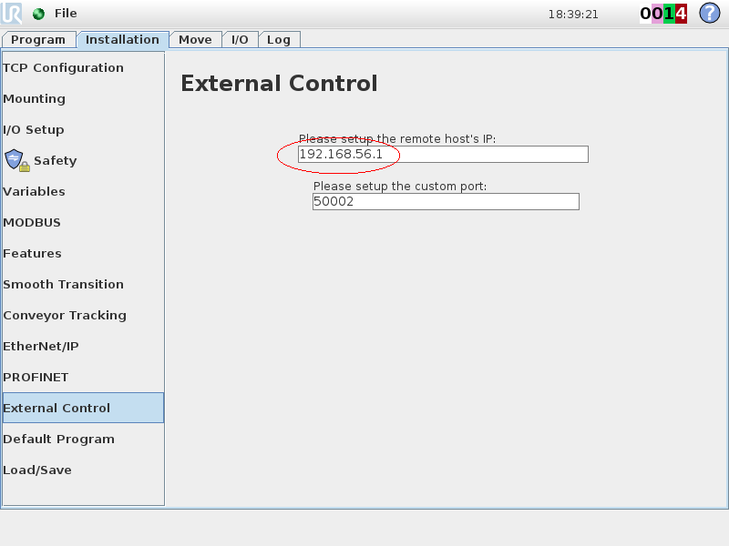
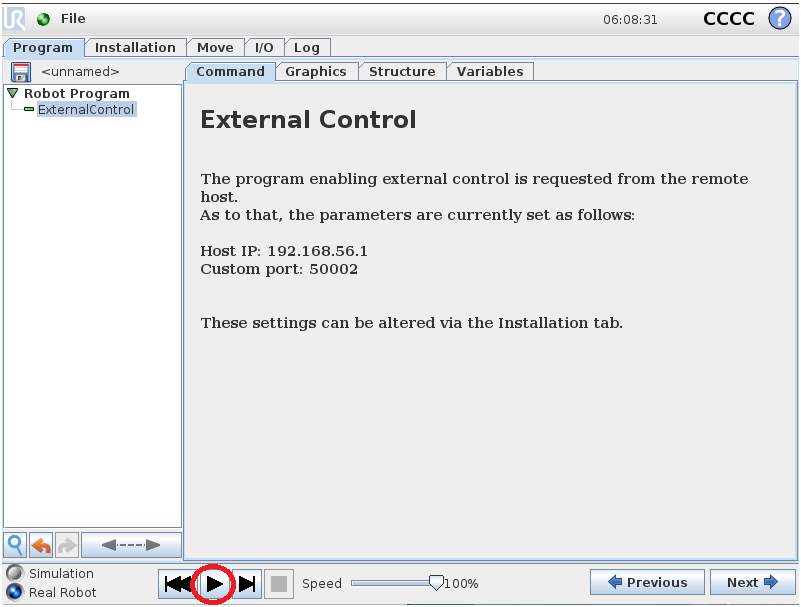

# ur10_acg_configuration

This package contains a quick guide to setup and use the UR10/CB3 robot by Universal Robots.

## The UR-10 Robot

The UR10/CB3 robot is developed by the company Universal Robots (<https://www.universal-robots.com/>). The specifications of this robot are given at the following link: <https://www.universal-robots.com/media/50880/ur10_bz.pdf>.

The simplest option for getting started talking to the robot is to use the Polyscope user interface on the teach pendant. The user manual contains extensive documentation of this interface. It is at the following link: <http://fab.cba.mit.edu/content/tools/universal_robot_arms/ur10_user_manual_en_global.pdf>.

## Dependencies

All files in this package have been used and tested with ROS Melodic. You can find the installation guide at the following link: <http://wiki.ros.org/melodic/Installation/Ubuntu>.

## Installing ROS-Industrial packages of UR10

In order to move and control the UR10 robot with ROS, you have to install the latest packages of Universal Robots.
After creating a workspace (<http://wiki.ros.org/catkin/Tutorials/create_a_workspace>), you clone the universal robot code to the `src` folder as follows:

```bash
cd /path/to/workspace/src

# the `calibration_devel` branch is cloned for compatibility reasons with the ROS driver of Universal Robots
git clone -b calibration_devel https://github.com/fmauch/universal_robot.git
```

The universal robot stack consists of the following packages:

* `ur_description`: contains the robot description and gazebo description of UR-3, UR-5, UR-10, UR-16 and their related e-series versions.

* `ur_bringup`: consists of launch files to start communication with the robot hardware controllers to start working with the real robot.

* `ur_gazebo`: consists of gazebo simulations of UR-3, UR-5, UR-10, UR-16 and their related e-series versions.

* `ur3_moveit_config`/`ur5_moveit_config`/`ur10_moveit_config`/`ur3e_moveit_config`/`ur5e_moveit_config`/`ur10e_moveit_config`/`ur16e_moveit_config`: these are the moveit config files of UR-3, UR-5, UR-10 and UR-16 robots and their related e-series versions.

* `ur_kinematics`: contains kinematic solver plugins for UR-3, UR-5, UR-10 and their related e-series versions, but it is not currently used.

Then, you have to build the packages using the catkin build command:

```bash
catkin build universal_robots
source /path/to/workspace/devel/setup.bash
```

If some deprecation warnings show up when building, they can be ignored.

## Installing a ROS driver for the UR10 robot arm

In order to communicate with Universal's industrial robot controllers, you have to install the `ur_robot_driver` package as follows:

```bash
cd /path/to/workspace/src

# retrieve the sources 
git clone https://github.com/UniversalRobots/Universal_Robots_ROS_Driver.git

cd /path/to/workspace

# checking dependencies 
sudo apt update
rosdep update
rosdep install --from-paths src --ignore-src -y

# building
catkin build ur_robot_driver

# activate the workspace (careful when also using other workspaces)
source /path/to/workspace/devel/setup.bash
```

For using the `ur_robot_driver` with a real robot follow the instructions reported at [this](https://github.com/UniversalRobots/Universal_Robots_ROS_Driver#setting-up-a-ur-robot-for-ur_robot_driver) link. Here it is required to install the `externalcontrol` URCap for the communication with the real robot. Note that for installing this URCap a minimal PolyScope version of 3.7 or 5.1 (in case of e-Series) is necessary. Otherwise you have to use the old `ur_modern_driver` package available [here](https://github.com/ros-industrial/ur_modern_driver). Moreover, it is also recommended to extract the calibration information from the real robot in order to avoid end-effector position errors. See the [`ur10_acg_calibration.yaml`](config/ur10_acg_calibration.yaml) file as an exemple.
The [`ur10_acg_bringup.launch`](launch/ur10_acg_bringup.launch) file has been generated to set custom parameters, e.g. robot ip, kinematics configuration file and ros-controllers to be loaded.

The `ur_robot_driver` currently supports the joint state controller, the joint_group_vel_controller, a force_torque_sensor_controller and four joint trajectory controllers: a position based one, a velocity based one and their scaled versions. Further information about scaled controllers can be found [here](https://github.com/UniversalRobots/Universal_Robots_ROS_Driver/tree/master/ur_controllers#ur_controllersspeedscalingstatecontroller). They are all loaded via the launch file, but only one of position/velocity controller can be running at a time. By default the not-scaled position based controller is started. You can switch controller by calling the appropriate service:

```bash
rosservice call /controller_manager/switch_controller "start_controllers:
- 'pos_joint_traj_controller'
stop_controllers:
- 'vel_joint_traj_controller'
strictness: 1"
```

Such service request contains a list of controller names to start, a list of controller names to stop and an integer to indicate the strictness (BEST_EFFORT==1 or STRICT==2). STRICT means that switching will fail and result in a no-op if anything goes wrong (an invalid controller name, a controller that failed to start, etc. ). BEST_EFFORT means that even when something goes wrong with one controller, the service will still try to start/stop the remaining controllers. The service response contains a boolean indicating success or failure. The list of controllers to stop or start can be an empty list, if you are only stopping or only starting controllers.

To use ros_control together with MoveIt!, be sure to add the desired controller name to the `ros_controllers.yaml` file in the urXX_moveit_config/config folder. Add the following:

``` bash
controller_list:
 - name: /pos_joint_traj_controller #or /vel_joint_traj_controller or /scaled_pos_joint_traj_controller #or /scaled_vel_joint_traj_controller
   action_ns: follow_joint_trajectory
   type: FollowJointTrajectory
   default: true
   joints:
      - shoulder_pan_joint
      - shoulder_lift_joint
      - elbow_joint
      - wrist_1_joint
      - wrist_2_joint
      - wrist_3_joint
```

Please be sure that the controller you specify under `name` is loaded by the controller manager. For example, as explained in the next section, both `ur10_bringup.launch` under `ur_gazebo` package and `ur10_acg_bringup.launch` under `ur10_acg_configuration` package load `pos_joint_traj_controller` only. 

## Connect to the robot

In order to move the simulated robot, you can run this command to start the simulation of UR10 with joint trajectory controllers.

```bash
roslaunch ur_gazebo ur10_bringup.launch 
```

This loads the controller `pos_joint_traj_controller`.

Otherwise, if you want to move the real robot, you can follow these commands:

If you want to run the `ur_robot_driver` package to connect to the hardware, you only need to run the following launch file.

```bash
roslaunch ur_robot_driver ur10_bringup.launch robot_ip:=xxx.xxx.xxx.xxx kinematics_config:=/path/to/your/kinematics_config/file
```

where `kinematics_config` file is used for calibration correction. This will be used to verify the robot's calibration is matching the robot_description. It can be automatically generated by executing the `calibration_correction.launch` file provided by the `ur_calibration` package under `Universal_Robots_ROS_Driver` repository.

Otherwise, if you have generated your custom configuration and launch files, as those in this package, run

```bash
roslaunch ur10_acg_configuration ur10_acg_bringup.launch
```

The above launch files make calls to both roscore and launch files of the `ur10_description` so that ROS's parameter server has information on the robot arm. Also, it loads the controller `pos_joint_traj_controller`.

If you want to use different controllers, you should modify the `controllers` argument in `ur10_acg_bringup.launch`, specifying the proper controller in `ros_controllers.yaml` accordingly. 

Only after running `ur10_acg_bringup.launch`, make sure to configure the `externalcontrol` URCap with the host (i.e. the computer on which the driver is running) IP address, as shown in the following figure:



After the **External Control** installation is configured, ensure also that the `externalcontrol` URCap is running on your robot by pressing the *Play* button in the teach pendant screen as the one shown in figure:



Once the bringup (for either the simulated or the real robot) is over, don't forget to launch the following command to start the MoveIt! nodes for motion planning and load robot's kinematics and semantic information.

```bash
roslaunch ur10_acg_configuration demo.launch
```

Then you can send joint position/velocity commands to the simulated or real robot through `rqt_joint_trajectory_controller` or through a MoveIt! controller.

If `rqt_joint_trajectory_controller` is not installed, just run

```bash
sudo apt install ros-melodic-rqt-joint-trajectory-controller
```

Once you have it installed, you can simply run

```bash
rosrun rqt_joint_trajectory_controller rqt_joint_trajectory_controller 
```
